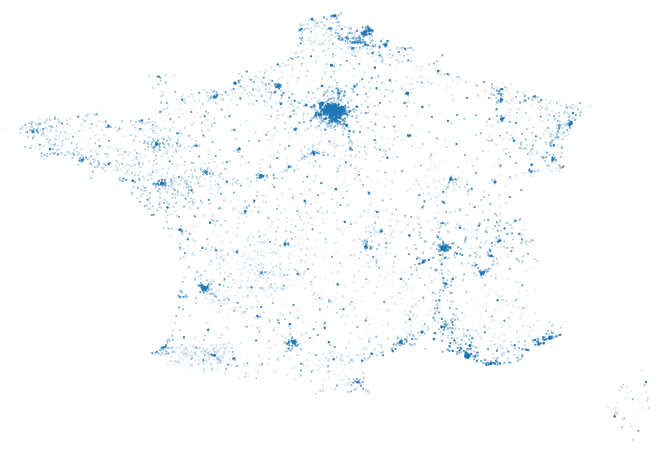
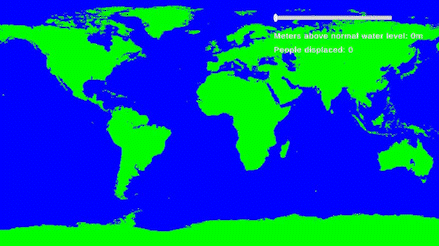

# City-Viewer


This is a project that can visualize the rising of water level, in addition the program can calculate the amount of people displaced as a cause of the water rise. The project also saves data of a lot of cities that can be visualized by scripts in the project.


# License


See license in the LICENSE file.


# Installation


## Cloning the project


Open your terminal and navigate to the directory where you want to clone the project.


Run the following command to clone the project:
```sh
git clone https://github.com/TheodorBeskow/City-Viewer
```


Then navigate into the project directory with this:
```sh
cd ./City-Viewer
```


## Installing needed configuration files


Make sure you have Node.js installed on your computer. If not, you can download it [here](https://nodejs.org/en/download/).


Now run the following command to install all the needed dependencies:
```sh
cd ./Scraper
npm install
cd ..
```


# Scrape data


## Quick note
The scraped data is already present in the project, so you will probably not need to do the following.


## Instructions


To scrape all the cities from a country enter the following command in the root of the project:
```sh
node ./Scraper/Scripts/index.js
```
If needed the Countries will be scraped scraped.


You will now be prompted to enter a country code or leave the input empty. If you do not know a certain country's country code you can look for it in the newly created CountryCodes.json file. Once you are happy with your decision press enter. You can now wait until the program is done scraping that country. During this time you can easily monitor the program with the self explanatory frequent logs to the console.


Once you have scraped all cities you will be informed that you are done. You now need to run the following command in order to be able to start the unity water level simulation.
```sh
node ./Scraper/Scripts/heightIndex.js
```


# Visualize


## Plotting


To plot all cities enter this in the terminal of the project root:
```sh
python ./Scraper/Scripts/VisualizeData.py
```
You can then enter the country code of a country. Look in 'CountryCodes.json' to find all countries' country codes. Alternative you can enter **all** to plot all countries, although this could lag a lot if you keep the minimum population low. There is also support to enter continents, you can do this by entering any character and then two characters to represent the continent. Continent representation can also be found in 'CountryCodes.json'. The input is not case sensitive.


You then need to enter the minimum population a city must have for it to be plotted. There are many cities that I do not have population for because the website I scraped from did not have population for all cities. These cities' populations are set to -1, so to plot all cities enter -1.


### Examples


```
Country code: fr
Show cities above a population of: -1
Plotting 5046 cities
```

```
Country code: _af
Show cities above a population of: -1
Plotting 200740 cities
```

```
Country code: all
Show cities above a population of: 100
Plotting 110245 cities
```


## Water height Simulation


Open the **CityViewUnity** folder in unity and launch it in Unity. Double click the **Scenes** folder and then again double click the **SampleScene**. Change the aspect ratio of the game view to 1920x1080. You can now just press play to start the simulation.

This project uses this height map to get the height of the world in different locations.


Showcase of the unity simulation. By using the scrollbar I am changing the water level. The simulation also displays the amount of people displaced as a cause of the water rise. To calculate people displaced I used the scraped cities in combination with the height map.


<!--  -->


<!-- https://github.com/Jorl17/open-elevation/blob/master/docs/host-your-own.md -->


<!-- The data should already be added to the unity project but if not, you will have to manually copy  the **Countries** folder in to the **Assets** folder in unity.
To start the simulation you can just press play and use the scrollbar to change the water level. -->


# Problems


## City Scraping


The website I scraped from had some problems that I tried to fix optimally. Some Countries like **American Samoa** and **Saudi Arabia** were displayed in the same place. Look [here](https://www.geonames.org/advanced-search.html?q=&country=AU&featureClass=P&startRow=0) for an example. I solved this by only scraping the correct country i.e. the country I filtered for. Another problem I encountered was that some cities were assigned to multiple countries/territories. In this case I only assigned the city to the alphabetically first country. An example is [here](https://www.geonames.org/advanced-search.html?q=&country=AX&featureClass=P&startRow=0) where some cities were assigned to **Finland** and **Åland**.


## Height Data


To get the elevation of different coordinates I used an image from [this](https://visibleearth.nasa.gov/images/73934/topography) website. The problem with the image is that it only can contain a range of heights from 0 to 255 since it is an image. To fix this issue I have written 3 different scripts to scrape 3 different websites with no success. The [first site](https://www.advancedconverter.com/map-tools/find-altitude-by-coordinates) had some measures to stop scraping by stopping to respond to queries after about 15 queries. The [second website](https://www.dcode.fr/earth-elevation) had similar measures and temporarily blocked me after just a few queries. The [third](https://www.advancedconverter.com/map-tools/find-altitude-by-coordinates) and final website did not have such measures but I realized far too late that the site could not handle a latitude less than -8. The **heightScraper.js** currently contains the code to scrape this website but to be able to send the data to Unity without scraping the elevation I added some code to ignore scraping. Instead I use the heightmap in Unity to get the elevation of cities.  


# Credits


The height map is downloaded from [this](https://visibleearth.nasa.gov/images/73934/topography) site.


[This](https://www.geonames.org) is the site I scraped from to get city data.


